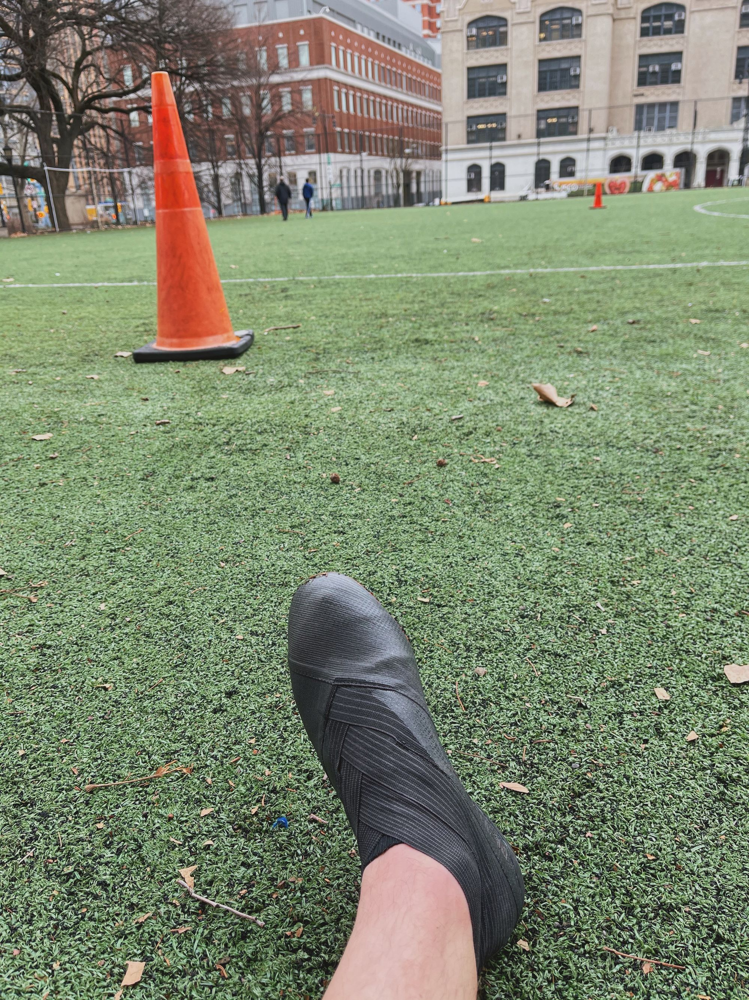

I feel a tremendous weight has been placed on the past few days, the first days since the constant calamity of 2020. I have certainly felt more hopeful and ready for a new year than perhaps ever, but I see that this expectation is not without weight. That weight, I've realized, has given my inner critic more input than is typical—especially since I have made that the focus of a fair amount of my work.

I was re-acclimating my feet to my soccer cleats on a nearby turf field when I burst out (in my head), "You're an asshole!" I'd felt this tension rising, but I had been trying to counter the critic's cutting criticism with compassionate words without acknowledging him directly. I had reached a boiling point and let him have it.

"You're an asshole!" I blurted out, "Nothing is ever good enough for you! Nothing can ever be!" This is nothing new. In that moment, I was talking about my expectations for how quickly and proficiently I should be completing this arbitrary running exercise I concocted after I had put on my cleats.

Yet, even as the conversation started, I knew it was about so much more than the workout. Conversations with my critic—as I suspect is the case for us all—are never only about a single moment in the present. Like every other I can remember, this conversation was about some insidious implicit messages I received growing up.

I felt like my dad pushed me harder than he did my sister, and I perceived my parents praising my sister more frequently than they did me. Growing up, I felt less celebrated and less able to explore my strengths. I understood the best I could at the time that all that I didn't receive—and the criticism I did receive along the way—was caused by my not being competent, proficient, tough, or patient enough; my imperfections were mortal wounds keeping me from the love and nurturing I desired most.

I recognize that as I haven't felt like I'm hitting the ground running this year, I've allowed him to speak louder. I'm so ready after graduating and searching for jobs these past few weeks to move on—I *expected it* somehow by today, yesterday—but that hasn't happened. Finally, when the tension of the past few days came to a head, I got pissed off.

A funny thing happened at this point. I got angry, yelled at the asshole, and then I got curious, and started listening again. That was how I realized where my inner critic got what he was wrongly trying to tell me.

He was indeed being a jerk, but sometimes that jerk can push me toward doing a better job than I would have done otherwise. Sometimes, like this afternoon, he's just a jerk. But why's he being a jerk?

My inner critic is trying to be helpful most of the time, but he doesn't understand compassion or empathy—that's not his job. What he's saying may be for my emotional or physical protection. You see, he carries a certain wisdom with him that he's accrued over the past few decades. He simply doesn't know how to package the message because he's an asshole.

Then, there are sometimes when he's just that asshole who doesn't know when to shut up. He's perceived some threat to our existence or wellbeing and feels the need to let me know vociferously. This is when I have to tell him that his input was not desired, let alone needed.

One of the most valuable lessons I learned in the past fifteen months was working on my inner observer. In essence, this is that part of the mind that can notice our emotions and thoughts non-judgmentally. It is the capacity to be curious about what we are doing and thinking and our reasons for doing so.

After my outburst, as I said earlier, I got curious and asked the critic why he was talking to me the way that he was and how his message had to do with keeping us safe. He was somewhat flustered and responded briskly. I noticed that his rationale did not line up—as I said, he was being an asshole—and then asked where we got this message of "never enough-ness."

I'm tearing up as I type this, but what I understood in where my mind went once I asked this question is a gift. My inner critic held onto this implicit message to help us plumb all the love and nurturing that was available during my childhood—he kept me well and in some aspects alive in this way. I am so grateful for that. Yet, today I don't really need to be told that I'm not enough. This doesn't serve me.

Presciently, as I was leaving the park, I received a message beginning with the words "It's ok to be proud of yourself." from a friend. The Universe has a beautiful way of sealing in those messages we need most, just in the way that we can understand what is happening. I walked to Target, feeling the cold breeze against my exposed face, hands, and legs, noting the warmth emanating from inside—up from my back, stomach, chest, and into my cheeks.
